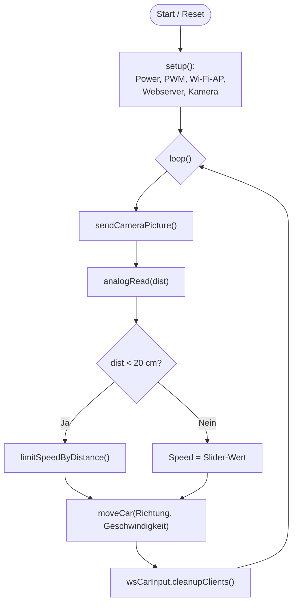
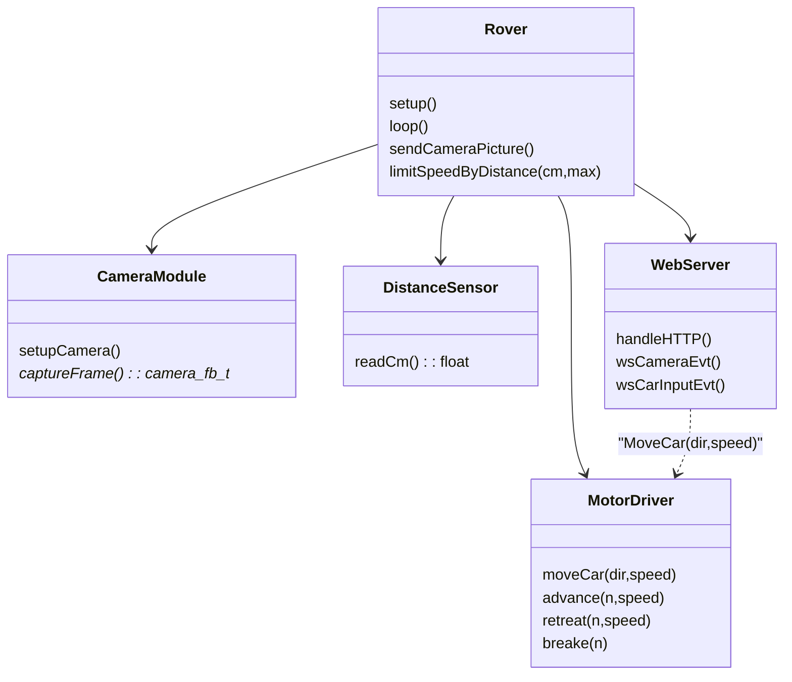

# 📡 ESP32 WiFi Rover

Dieses Projekt implementiert eine webbasierte Fernsteuerung für einen Rover, der auf der ESP32-Plattform basiert. Der Rover verfügt über vier Gleichstrommotoren, einen Ultraschallsensor zur Hinderniserkennung und einen Kamera-Stream, der über WebSockets bereitgestellt wird.

---

## 🎯 Ziele

### Muss-Kriterien
* Rover fährt (vorwärts, rückwärts, links, rechts). ✅
* Kann ferngesteuert werden. ✅
* WiFi Access Point mit Kamera-Stream. ✅
* Distanzsensor zeigt Distanz an. ✅

### Wunsch-Kriterien
* Rover passt Geschwindigkeit an die Distanz an. ✅
* Integrierter Lautsprecher. ❌

---

## ⚙️ Funktionen

* **WiFi-Access-Point**: Der ESP32 betreibt einen WLAN-Access-Point (`WiFiRover`), über den sich Clients verbinden können.
* **Webserver & WebSockets**:
    * Der HTTP-Server liefert die HTML-Benutzeroberfläche.
    * WebSocket `/Camera` streamt JPEG-Bilder der Kamera.
    * WebSocket `/CarInput` empfängt Steuerbefehle (Geschwindigkeit, Richtungsbefehle) und sendet Sensordaten (Abstand).
* **Motorsteuerung**:
    * Vier Motoren werden über MCPWM (Motor Control PWM) des ESP32 gesteuert.
    * Unterstützte Bewegungen: Vorwärts, Rückwärts, Links, Rechts und Stopp.
    * Automatische Geschwindigkeitsbegrenzung basierend auf der Ultraschall-Abstandsmessung (lineare Anpassung zwischen 20 cm und 100 cm).
* **Kamera** 📹:
    * Initialisierung der ESP32-Kamera mit JPEG-Streaming-Funktion.
* **Ultraschallsensor**:
    * Auslesung über einen 12-Bit ADC (Wertebereich 0–4095), umgerechnet auf einen Distanzbereich von 0–520 cm.
    * Der gemessene Abstand wird alle 200 ms über WebSocket an den Client gesendet.

---

## 🚀 Nutzung

1.  Mit dem WLAN-Netzwerk `WiFiRover` verbinden (Kennwort: `12345678`).
2.  Im Browser die IP-Adresse `192.168.4.1` aufrufen.
3.  Kamera-Stream und Steuerung erfolgen über einen virtuellen Joystick bzw. Pfeiltasten und einen Geschwindigkeits-Slider auf der Webseite.

---

## 🔄 Applikationsablauf

### Initialisierung `setup()`
* Initialisierung der seriellen Kommunikation und des AXP313A Power Managers.
* Aktivierung der Kamerastromversorgung.
* Initialisierung der MCPWM-Einheiten für die Motorsteuerung.
* Konfiguration des ESP32 als WLAN Access Point.
* Start des Webservers mit Routing für die HTML-Hauptseite und den WebSocket-Endpunkten.
* Initialisierung der Kamera.

### Hauptschleife `loop()`
* Kontinuierliches Senden von Kamerabildern an verbundene Clients.
* Auslesen des Abstandssensors.
* Periodisches Senden (alle 200 ms) der Distanzdaten an verbundene Clients.
* WebSocket-Nachrichten (z.B. `MoveCar`, `Speed`) vom Client werden asynchron durch Callback-Funktionen (`onCarInputWebSocketEvent`) verarbeitet, welche die Motorsteuerung oder Geschwindigkeitsparameter anpassen.

---

### Flussdiagramm (Flowchart)

---

### Funktionendiagramm

---

## 🛠️ Tests und Erfahrungen

* LiDAR-Modul: Ein Test mit einem LiDAR I²C-Modul zeigte, dass entweder nur die Kamera oder nur das Modul gleichzeitig betrieben werden konnte, nicht jedoch beide Komponenten zusammen. 😢
* Ultraschallsensor: Daraufhin erfolgte die Umstellung auf einen analogen Ultraschallsensor. Dieser funktioniert wie erhofft und zuverlässig. 👍

### ⚠️ Limitationen
Bei einer schlechten WLAN-Verbindung kann es zu Latenzen im Video-Stream kommen.Controller möglichst nahe beim Rover zu halten, um eine stabile Verbindung zu gewährleisten.

